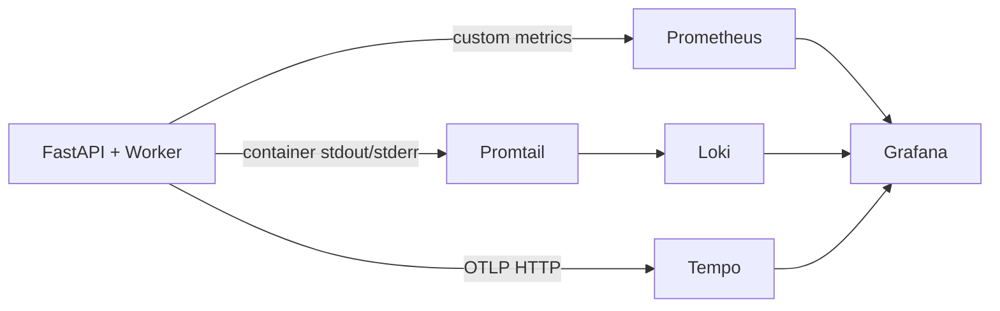

# Observability

## Stack Overview



| Pillar | Tool | What it captures |
|--------|------|-----------------|
| **Metrics** | Prometheus | Request counts, latencies, token usage, LLM spend, tool execution, agent routing |
| **Traces** | Tempo (via OpenTelemetry) | Per-request spans across LLM calls, tool execution, retrieval, ingestion |
| **Logs** | Loki (via Promtail) | Container logs scraped from all Docker services |
| **Dashboards** | Grafana | Three pre-provisioned dashboards + alert rules |

## Prometheus Metrics

All custom metrics are defined in `observability/metrics.py` with the `agenticrag_` prefix.

### LLM Metrics

| Metric | Type | Labels | Description |
|--------|------|--------|-------------|
| `agenticrag_llm_requests_total` | Counter | operation, provider, model, stream, status, chat_type | Total LLM requests by outcome |
| `agenticrag_llm_request_duration_seconds` | Histogram | operation, provider, model, stream, status, chat_type | LLM request latency |
| `agenticrag_llm_tokens_total` | Counter | provider, model, token_type, chat_type | Prompt and completion token volume |
| `agenticrag_llm_spend_usd_total` | Counter | provider, model, chat_type | Estimated LLM spend in USD |
| `agenticrag_llm_ttft_seconds` | Histogram | provider, model, chat_type | Time-to-first-token for streaming |
| `agenticrag_llm_output_tokens_per_second` | Histogram | provider, model, chat_type | Streaming output generation speed |

### High-Cardinality Session Metrics

Gated behind `OBS_ENABLE_HIGH_CARDINALITY_METRICS` (default: on). These use hashed identity labels for per-session and per-user breakdowns without exposing raw IDs.

| Metric | Type | Labels | Description |
|--------|------|--------|-------------|
| `agenticrag_llm_session_tokens_total` | Counter | session_hash, user_hash, project_hash, chat_type | Token totals per session |
| `agenticrag_llm_session_spend_usd_total` | Counter | session_hash, user_hash, project_hash, chat_type | Spend per session |

### Tool Metrics

| Metric | Type | Labels | Description |
|--------|------|--------|-------------|
| `agenticrag_tool_calls_total` | Counter | tool_name, status | Tool execution attempts |
| `agenticrag_tool_duration_seconds` | Histogram | tool_name, status | Tool execution latency |
| `agenticrag_tool_cache_total` | Counter | tool_name, cache_status | Cache hit/miss/skip per tool |

### Agent & Orchestration Metrics

| Metric | Type | Labels | Description |
|--------|------|--------|-------------|
| `agenticrag_agent_routes_total` | Counter | selected_agent, route_mode, status | Agent routing decisions |
| `agenticrag_agent_route_duration_seconds` | Histogram | route_mode, status | Agent routing latency |
| `agenticrag_orchestration_steps_total` | Counter | mode, reason | Planning decisions per orchestration step |
| `agenticrag_orchestration_tool_selection_total` | Counter | mode, selection | Requested/executed/suppressed tool calls |
| `agenticrag_orchestration_duplicate_suppressions_total` | Counter | tool_name | Duplicate tool call suppressions |
| `agenticrag_max_tool_calls_reached_total` | Counter | chat_type | Turns hitting max tool call budget |
| `agenticrag_tool_budget_exhausted_total` | Counter | chat_type, budget | Budget exhaustion events (reasoning_steps or total_tool_calls) |
| `agenticrag_summarization_events_total` | Counter | chat_type, reason | Conversation summarization triggers |
| `agenticrag_retrieval_results_count` | Histogram | agent_name | Retrieved chunk count per query |
| `agenticrag_retrieval_duration_seconds` | Histogram | cache_status | End-to-end RAG retrieval latency (cache lookup + vector search + rerank), `hit`/`miss` |
| `agenticrag_session_budget_blocked_total` | Counter | chat_type, limit | Chat turns refused by the per-session spend guardrail |

### HTTP Metrics

Defined in `api/server.py`:

| Metric | Type | Labels | Description |
|--------|------|--------|-------------|
| `http_requests_total` | Counter | method, path, status_code | Total HTTP requests |
| `http_request_duration_seconds` | Histogram | method, path | HTTP request latency |

## OpenTelemetry Tracing

Tracing is gated behind `OTEL_ENABLED=true`. When enabled, `setup_tracing()` in `observability/tracing.py`:

1. Creates a `TracerProvider` with service name `agenticrag`
2. Configures an OTLP HTTP exporter pointing to Tempo
3. Attaches auto-instrumentors for:
   - **FastAPI** — spans for every HTTP request
   - **Redis** — spans for every Redis command
   - **SQLAlchemy** — spans for every database query
   - **HTTPX** — spans for outgoing HTTP calls (LLM API requests)

### Custom Spans

Beyond auto-instrumentation, the application creates manual spans in `observability/spans.py`:

| Span | When created | Key attributes |
|------|-------------|----------------|
| `chat.turn` | Each general chat turn | chat_type |
| `project_chat.turn` | Each project chat turn | chat_type |
| `llm.completion` | Every LLM call | provider, model, stream, operation, usage, cost |
| `tool.*` | Each tool execution | tool_name, status, cached |
| `retrieval` | Each vector search | project_id, result_count |
| `ingestion` | Document ingestion | document_id, chunk_count |

## Context Propagation

Observability labels are propagated through async execution contexts using `ContextVar` in `observability/context.py`. Each chat turn pushes context at the start and pops it at the end:

```python
context_tokens = push_context(
    chat_type="general",
    session_id=session_id,
    user_id=user_id,
)
try:
    # ... entire chat turn ...
finally:
    pop_context(context_tokens)
```

Fields carried through context:

| Field | Source | Usage |
|-------|--------|-------|
| `chat_type` | `"general"` or `"project"` | Labels on all metrics emitted during the turn |
| `user_hash` | `stable_hash(user_id)` | High-cardinality session metrics |
| `session_hash` | `stable_hash(session_id)` | High-cardinality session metrics |
| `project_hash` | `stable_hash(project_id)` | High-cardinality session metrics |
| `agent_name` | Set during agent routing | Agent-scoped metrics |

### Hashed Identity Labels

Raw user/session/project IDs are never used as metric labels. Instead, `observability/hash.py` produces deterministic hashes using `OBSERVABILITY_HASH_SALT`. This allows correlating metrics across a session without exposing PII in Prometheus.

## Grafana Dashboards

Three dashboards are auto-provisioned from `monitoring/grafana/provisioning/dashboards/`:

| Dashboard | Focus |
|-----------|-------|
| **RunaxAI - Economics** | LLM spend by provider/model, token usage trends, cost per chat type, session spend-guardrail blocks |
| **RunaxAI - Operations** | Agent routing distribution, tool call counts, orchestration step analysis, retrieval chunk counts, duplicate suppression rates |
| **RunaxAI - UX & Latency** | TTFT distribution, request duration, streaming output speed, chat/stream p50/p95 by mode, RAG retrieval p50/p95, HTTP request rates |

### Alert Rules

Alert rules are provisioned from `monitoring/grafana/provisioning/alerting/`. Rules are pre-configured but **contact points must be set manually** in the Grafana UI (email, Slack, PagerDuty, etc.).

## Cost Estimation

LLM spend is estimated using LiteLLM's `cost_per_token()` function, which maintains a pricing database for major providers. The estimate is:

1. Computed per-call using prompt and completion token counts
2. Recorded as a Prometheus counter (`agenticrag_llm_spend_usd_total`)
3. Attached to OpenTelemetry spans as a `cost_usd` attribute
4. Broken down by provider, model, and chat type

When token usage isn't reported by the provider (common with some streaming implementations), the client estimates tokens using `litellm.token_counter()` before computing cost.

## Spend Guardrails

Two layers bound LLM spend, each with sane, env-tunable defaults.

### Per-turn context cap (summarization)

Each chat turn measures its prompt token count and, once it exceeds a threshold, collapses older history into a summary before the next turn. This caps the size — and therefore the per-call cost — of any single request.

| Path | Constant | Default | Behavior on breach |
|------|----------|---------|--------------------|
| General chat | `MAX_PROMPT_TOKENS` (`api/chat.py`) | 40,000 | Summarize conversation |
| Project chat | `MAX_PROMPT_TOKENS` (`api/project_chat.py`) | 60,000 | Summarize conversation |
| Worker prompts | `MAX_PROMPT_TOKENS` (`main.py`) | 10,000 | Summarize conversation |
| Per uploaded file | `MAX_TOKENS_PER_DOCUMENT` (`pipeline/chat_attachments.py`) | 25,000 | Reject the file |
| Per session attachments | `MAX_SESSION_ATTACHMENT_TOKENS` (`pipeline/chat_attachments.py`) | 25,000 | Reject the upload |

### Per-session spend ceiling

`api/session_budget.py` enforces a cumulative token ceiling per chat session, backed by a Redis counter that shares the 24h session TTL. Every turn's prompt+completion tokens are added to the counter; once a session crosses the ceiling, further turns are refused with a user-facing error (`event: error`) and a `budget_exceeded` `done` event. This bounds the blast radius of runaway tool loops, abusive clients, or pathological conversations.

| Env var | Default | Meaning |
|---------|---------|---------|
| `MAX_SESSION_TOKENS` | 2,000,000 | Cumulative prompt+completion tokens allowed per session. `0` disables enforcement. |

Design notes:

- **Fails open.** Any Redis error during the budget check allows the turn — an observability guardrail must never take down the chat path.
- **Generous by default.** 2M tokens is far above any honest single conversation (~/session at GPT-4o-class blended pricing), so it only trips on abuse/runaways. Lower it per-environment for tighter cost control.
- **Observable.** Trips are counted in `agenticrag_session_budget_blocked_total{chat_type}` and surfaced on the **Economics** dashboard ("Session Spend Guardrail Blocks").

## Baseline

Live spend/latency baselines are read from Grafana once production traffic flows; the dashboards above are the source of truth. Useful baseline queries (Explore -> Prometheus):

```promql
# Blended cost per 1K tokens (range)
(1000 * sum(increase(agenticrag_llm_spend_usd_total[$__range])))
  / clamp_min(sum(increase(agenticrag_llm_tokens_total[$__range])), 1)

# Chat/stream completion latency p50 / p95 by mode
histogram_quantile(0.50, sum by (le, chat_type) (rate(agenticrag_llm_request_duration_seconds_bucket{operation="completion",stream="true"}[5m])))
histogram_quantile(0.95, sum by (le, chat_type) (rate(agenticrag_llm_request_duration_seconds_bucket{operation="completion",stream="true"}[5m])))

# RAG retrieval latency p50 / p95 by cache status
histogram_quantile(0.50, sum by (le, cache_status) (rate(agenticrag_retrieval_duration_seconds_bucket[5m])))
histogram_quantile(0.95, sum by (le, cache_status) (rate(agenticrag_retrieval_duration_seconds_bucket[5m])))
```

**Cost-model baseline (bounded worst case).** Because per-turn prompt size is capped (see above), the maximum spend per turn is bounded. At GPT-4o-class blended pricing (~/1M input, ~/1M output), a worst-case general-chat turn (40K prompt + ~2K output) costs ~, and a project-chat turn (60K prompt + ~2K output) ~. With the 2M-token session ceiling, a single session is hard-capped at roughly  of spend. These are upper bounds; typical turns are far smaller. Replace with measured values from the queries above once real traffic is captured (target: record p50/p95 latency and /1K-token blended cost after the first week of production traffic).
