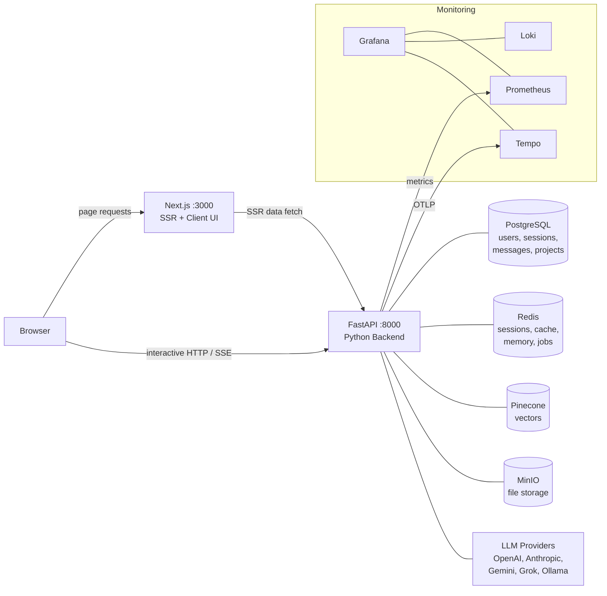

In a production-grade agentic chat application, PostgreSQL is great for durable, long-term truth, but it is too slow to serve as the hot-path state engine for an active conversational loop. 

In RunaxAI, **Redis** acts as the high-speed backbone for the entire application. We multiplex a single Redis instance across several distinct roles by leveraging specific key patterns and Time-To-Live (TTL) strategies.



## 1. Active Session Management

When a user is actively chatting, the frontend streams SSE (Server-Sent Events) from the FastAPI backend. The entire history of that active session needs to be injected into the LLM context on every turn.

- **`session:<id>`**: Stores the JSON array of the conversation's message history. It has a 24-hour TTL.
- **`session:<id>:user`**: Binds the session to the authenticated user ID for security validation.

During a chat stream, the orchestrator repeatedly updates this Redis key as tool calls are executed and results are returned. Only when the stream *completes* is the final state bulk-persisted to PostgreSQL for durable history. If a session is evicted from Redis after 24 hours, the system seamlessly restores it from Postgres upon the user's next visit.

## 2. Semantic Caching for Tools and Retrieval

LLM API calls and vector database lookups are expensive and slow. If a user asks a question, then reframes it slightly, or if two users run the same web search, we shouldn't incur the full latency and cost of executing the tool again.

We implemented a **Semantic Cache** (`cache:*` keys) that intercepts tool executions (like web searches or KB queries) and RAG retrieval pipelines.

When the `tool_router` intercepts a tool call, it checks the cache for similar recent queries. If a match is found, the tool execution is bypassed entirely, saving seconds of latency. 

We even built a **Cache Audit mechanism**:
```python
CACHE_AUDIT_RATE = float(os.getenv("RETRIEVAL_CACHE_AUDIT_RATE", "0.05"))
```
When enabled, the system will randomly select 5% of cache hits and asynchronously execute the real retrieval in a background thread. It compares the cached results against the fresh results and logs the overlap. This allows us to empirically validate that our cache isn't returning stale or drift-heavy data without impacting user latency.

## 3. The Memory Cursor & Lock

RunaxAI extracts long-term atomic memories from user conversations. To ensure this doesn't block the active chat experience, it runs off-path in a background worker (`arq`, which itself uses Redis as a job queue).

To coordinate this background task with the active session, Redis manages:
- **`memory-task-lock:<session_id>`**: A 5-minute lock that prevents concurrent extraction workers from stepping on each other if a user sends messages rapidly.
- **`memory-last-extracted:<session_id>`**: A content-hash cursor (SHA-256) pointing to the last processed message. This allows the worker to efficiently slice the conversation and process only the delta, even if the older messages were summarized and collapsed.
- **`memory-summary:<session_id>`**: A rolling prose summary of the recent conversation, used by the extractor to disambiguate pronouns (e.g., knowing that "Yes, do that one" refers to a previously mentioned tool output).

By centralizing working memory, cache layers, and distributed locks into Redis, the FastAPI backend remains entirely stateless. This allows us to scale the API nodes horizontally while maintaining sub-millisecond access to the active conversational context.