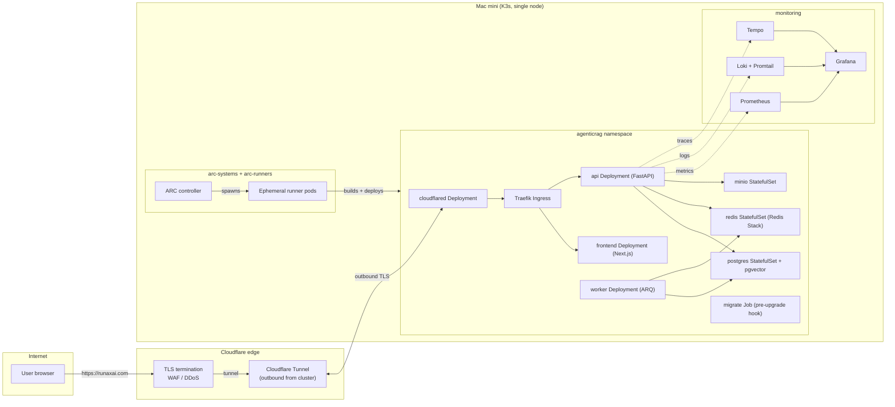

There is a Mac mini sitting under my desk. It runs K3s. It runs RunaxAI. It runs the CI runners that build and deploy RunaxAI. It costs me nothing per month except electricity. This post is how that works.



## The shape of the thing

The deployment is one Helm chart at `helm/agenticrag` that defines everything the app needs:

- **`api`** — the FastAPI backend, 2 uvicorn workers, liveness on `/health` and readiness on `/ready`, with an HPA that's off by default and a PDB that's off by default. Both flip on with one value override when load justifies them.
- **`frontend`** — the Next.js app, identical scaffolding (HPA + PDB + probes).
- **`worker`** — the ARQ worker that runs document ingestion and memory persistence off the request path.
- **`postgres`** — a single StatefulSet running `pgvector/pgvector:pg17`. One DB for everything: auth, chat history, semantic memory facts.
- **`redis`** — a single StatefulSet running Redis Stack (we use RediSearch for the tool and retrieval caches).
- **`minio`** — a StatefulSet with a public ingress (`storage.runaxai.com`) so the frontend can hit presigned PUT/GET URLs directly without proxying multi-megabyte file bodies through the API.
- **`monitoring`** — Prometheus, Loki + Promtail, Tempo, and a Grafana behind BasicAuth. All four optional; the dashboards live in a ConfigMap.
- **`migrate` job** — runs `alembic upgrade head` as a Helm pre-upgrade hook so schema changes land before any pod that depends on them starts.
- **`tunnel`** — the Cloudflare Tunnel (`cloudflared`) deployment.
- **`ddns`** and **`cert-manager`** — both shipped, both disabled in prod because the tunnel replaces them. They're there so the same chart can drive a different topology (DDNS + Let's Encrypt) when someone wants to expose ports directly.
- **`networkPolicy`** — disabled by default, lets you lock down pod-to-pod traffic by component once everything settles.

One chart, two values files: `values.yaml` (single-node dev defaults — `ClusterIP` services, `enabled: false` on the optional bits) and `values.prod.yaml` (real hostnames, ingress hosts, tunnel on, monitoring on). A third file with secrets gets injected at deploy time from a Kubernetes Secret that's loaded onto the cluster once and never round-trips through GitHub.

## Why a Mac mini

People expect "homelab" to mean "hobby." For a single-tenant AI app with no traffic spikes worth worrying about, it is the correct production answer.

- M-series silicon gives you a quiet, low-watt, fanless-most-of-the-time box that costs less than three months of comparable cloud spend.
- K3s installs in one command and uses negligible memory; the cluster overhead is around 200 MB.
- ARM64 throughout — the chart and Dockerfiles are `linux/arm64`, matching the Mac mini, matching modern cloud ARM instances if I ever migrate.
- Local storage is fast and free. Postgres + pgvector + Redis Stack + MinIO all run happily on the same disk.

The one part this would be wrong for: a stateful service with strict HA requirements. That's not what RunaxAI is. It's a single-replica app where the bottleneck is LLM API calls, not local compute.

## Cloudflare Tunnel kills port forwarding

The traditional homelab story has three pieces: dynamic DNS, port forwarding on the router, and a TLS cert from Let's Encrypt via cert-manager. Each one is its own footgun.

The chart still ships all three (`ddns`, `certManager`, ingress with `cert-manager.io/cluster-issuer`) for people running outside Cloudflare. In production I run none of them. Instead:

- A single `cloudflared` pod (`helm/agenticrag/templates/tunnel/deployment.yaml`) holds an **outbound** TLS connection to Cloudflare's edge.
- Cloudflare's edge terminates TLS for `runaxai.com`, `blog.runaxai.com`, `api.runaxai.com`, `storage.runaxai.com`, `grafana.runaxai.com`.
- Inbound user traffic hits Cloudflare, gets routed down the tunnel to the cluster's Traefik ingress, and from there to the right service.

What that buys me:

- **No public IP exposed.** The router is not port-forwarded. The cluster sits behind NAT and reaches out, not in.
- **No cert management.** Cloudflare handles the public-facing cert. I'd happily run cert-manager + DNS-01 if needed, but I don't need it.
- **WAF, DDoS, bot-fight for free.** All the Cloudflare edge features come along with the tunnel.
- **One secret to wire it.** A `TUNNEL_TOKEN` lives in the same Kubernetes Secret as the rest of the app's credentials.

The tunnel pod's resource requests are 10m CPU and 32Mi memory. It is the smallest deployment in the cluster and one of the most important.

## Traefik does the inside job

K3s ships Traefik as its default ingress. I left it. Inside the cluster, all hostname routing is one `Ingress` object:

```
runaxai.com           → frontend
blog.runaxai.com      → frontend
api.runaxai.com       → api
storage.runaxai.com   → minio
grafana.runaxai.com   → grafana
```

Traefik handles path-prefix routing inside the app — the frontend gets `/`, but the API gets explicit prefixes (`/auth`, `/users`, `/chat`, `/session`, `/projects`, `/metrics`, `/health`, `/ready`) before the frontend catch-all. That keeps the frontend rewrite logic minimal and lets cookies be scoped properly.

In dev (single-node OrbStack) the same chart flips `global.serviceType` to `LoadBalancer` so OrbStack assigns routable IPs and I can skip the ingress entirely. Same chart, different environment, one value flag.

## Self-hosted runners on the same cluster

The deploy workflow runs on `runs-on: agenticrag-runners` — a self-hosted runner scale set living in the same K3s cluster as the app it deploys. Setup is documented under `helm/github-runners/`.

The split:

- **`arc-systems`** — the Actions Runner Controller (`oci://ghcr.io/actions/actions-runner-controller-charts/gha-runner-scale-set-controller`). One controller pod.
- **`arc-runners`** — the runner scale set itself (`gha-runner-scale-set`), ephemeral runner pods that spin up to claim queued jobs and disappear afterward.

GitHub recommends keeping the controller and runner pods in dedicated namespaces apart from the application release. The chart in `helm/github-runners/` follows that — it's a separate install, intentionally not bundled with `helm/agenticrag`.

The runner pod has in-cluster RBAC (see `helm/github-runners/rbac.yaml`) that lets it `helm upgrade` the app's namespace and read the Helm secrets Secret. Nothing else. The runner can deploy the app; it cannot, for example, read user data from the Postgres pod.

Why bother instead of GitHub-hosted runners?

- **ARM64 builds.** GitHub's hosted Linux runners are x86_64. The chart and images are `linux/arm64`. Hosted ARM runners exist but cost money. The Mac mini runs ARM natively.
- **Free.** Self-hosted minutes don't count against the plan.
- **Local cache locality.** The Buildx registry cache at `ghcr.io/.../buildcache` is hot because every build runs on the same runner subnet.

The one job that does run on GitHub-hosted (`ubuntu-latest`) is `notify-failure`. That's deliberate: if the runners themselves are unhealthy (Mac mini offline, ARC controller crashed), I want the failure notification to fire anyway, from a runner that doesn't depend on the thing that just broke.

## The deploy pipeline, step by step

`.github/workflows/deploy.yml` has three jobs:

**1. `build-push` (self-hosted runner)**
- Checkout, set up Buildx, log in to GHCR.
- Build the API image as `linux/arm64`, push to `ghcr.io/pragadeesh122/agenticrag-api:sha-<short>` and `:latest`, using a registry buildcache.
- Scan the API image with Trivy (`severity: CRITICAL`, `exit-code: 1`, with a `.trivyignore` for accepted CVEs and `TRIVY_PLATFORM=linux/arm64` because Trivy defaults to amd64).
- Same for the frontend image.

**2. `deploy` (self-hosted runner, depends on `build-push`)**
- Install Helm and kubectl if missing.
- Pull the secrets values file out of a Kubernetes Secret on the cluster: `kubectl get secret helm-values-secrets -n arc-runners -o jsonpath=... | base64 -d > /tmp/values-secrets.yaml`. This is the trick that keeps secrets off GitHub entirely — they're loaded onto the cluster once with `kubectl create secret --from-file=...` and the runner reads them at deploy time.
- `helm upgrade --install agenticrag ./helm/agenticrag -f values.yaml -f values.prod.yaml -f /tmp/values-secrets.yaml --set api.image.tag=sha-<short> ... --atomic --timeout 10m`. The `--atomic` flag rolls back automatically on any failure (a probe never reporting Ready, a manifest validation error, a hook job dying).
- Smoke test: hit `https://api.runaxai.com/health` up to five times with a 6-second sleep between attempts. cert-manager and ingress can lag a few seconds behind a Helm release going Ready; the retry handles that without making the test flaky.

**3. `notify-failure` (GitHub-hosted, `if: failure()`)**
- Opens a GitHub issue tagged `deploy-failure` with the commit, the run URL, the actor, and the branch.

`concurrency: deploy` ensures only one deploy runs at a time — a new push cancels any in-flight deploy.

## Migrations as a pre-upgrade hook

Schema changes are the one thing that can ruin a "just `helm upgrade`" story. Two patterns I wanted to avoid:

- API pods racing to run migrations on startup. Multiple pods, one DB, concurrent `alembic upgrade head` calls — flaky at best, corrupt at worst.
- Migrations baked into image entrypoints. They run on every restart, not on every deploy. Wrong frequency.

The chart resolves this with a dedicated `migrate` Job (`templates/jobs/migrate.yaml`) that runs as a Helm pre-upgrade hook. Helm waits for it to complete (or fail) before applying the rest of the release. The API Deployment also has a `run-migration` init container as a belt-and-suspenders for fresh installs. The worker has neither — it shouldn't touch schema, ever.

The same `migrate` service exists in `compose.yml` for parity, running once before `api` and `worker` start.

## Where secrets live

Three layers:

1. **Cluster:** a Kubernetes Secret named `helm-values-secrets` in the `arc-runners` namespace, created once with `kubectl create secret generic ... --from-file=values-secrets.yaml=helm/values-secrets.yaml`. This holds Cloudflare token, DB passwords, MinIO keys, LLM provider API keys, JWT secret, Grafana BasicAuth.
2. **CI runner:** during `deploy`, the runner extracts that Secret into `/tmp/values-secrets.yaml` and passes it to `helm upgrade -f /tmp/...`. The file lives for the duration of one job and is gone with the pod.
3. **Inside the app:** Helm materialises a per-release Secret (`templates/secrets.yaml`) that the API and worker mount as env vars.

GitHub itself never sees any production secret. `.env`, the local dev file, is excluded from the Docker build context by `.dockerignore`.

## What I haven't done yet, and why it's fine

A few things on the "if it matters" list:

- **HA Postgres.** Single StatefulSet. If the disk dies, the chart can be reapplied and the database restored from backup, but there's downtime. Postgres replication is one Helm value away (it's not enabled because there's no second machine to put the replica on).
- **HA Redis.** Same shape. Single Redis Stack instance. For session state and caches, this is fine; we'd lose live sessions on restart but Postgres holds the durable history.
- **Multi-node K3s.** A second Mac mini would let me run actual HA. Today the single node is the system; if it goes down, the deploy pipeline notices via `notify-failure`, and the site is down until I poke it.
- **Network policies.** Defined in the chart, off by default. The intent is to enable them once the dependency graph between pods is locked, so a compromised pod can't reach anything it shouldn't.
- **Pinning runner image by digest.** The README notes this is the right move for prod; today the runner image is `:latest`, which is fine for a single repo.

The principle for each one is the same: the chart is *ready* for that level of hardening, and turning it on is one or two values away. I haven't paid the operational cost of running them because the current shape doesn't need them.

## The full deploy sequence, from `git push`

To close the loop, this is what happens when I land a change on `main`:

1. `pr.yml` already ran on the PR — `API tests` and `Build images` green, the ruleset on `main` allowed the merge.
2. `deploy.yml` fires on the push to `main`. `concurrency: deploy` cancels any in-flight run.
3. An ephemeral runner pod spins up in `arc-runners`. The ARC controller hands it the job.
4. The runner builds the API and frontend images for `linux/arm64`, pushes them to GHCR with a `sha-<short>` tag and `:latest`, using the registry buildcache so the build is incremental.
5. Trivy scans both images. Anything CRITICAL + fixed + not in `.trivyignore` blocks the deploy.
6. The runner pulls the `helm-values-secrets` Secret out of the cluster, runs `helm upgrade --atomic`.
7. Helm runs the `migrate` pre-upgrade Job first, waits for it to finish, then rolls out the new pods one component at a time.
8. The smoke test hits `https://api.runaxai.com/health` until it gets a 200 or gives up.
9. Cloudflare's tunnel was always up; the new pods register with the in-cluster ingress; user traffic shifts onto them as the readiness probes flip.
10. If anything failed, `notify-failure` on a GitHub-hosted runner opens a `deploy-failure` issue.

End-to-end, push to traffic on the new revision takes about four minutes. Most of that is the Docker build; the Helm rollout itself is well under a minute because the registry pull is local-ish (GHCR over the tunnel) and there's nothing fancy in the readiness gate.

## What a contributor sees vs what I see

To open a PR, a contributor needs nothing on their machine except `yarn`, `uv`, and Docker. They run `docker compose up`, the stack starts, they iterate, they push, the ruleset on `main` enforces `API tests` and `Build images` green before the merge button works.

To run production, I have: one Mac mini, one Cloudflare account, one GitHub repo, one cluster Secret, and the chart. That's the full materials list. Everything else — DNS records, image registry, runners, cert handling — is either Cloudflare-managed or in-cluster.

That's the homelab pitch when the homelab is the production environment. Not "good enough for hobbies." Genuinely the right answer for a single-tenant app where the cost of the second nine of availability is way higher than the cost of accepting the first nine and getting on with shipping.
