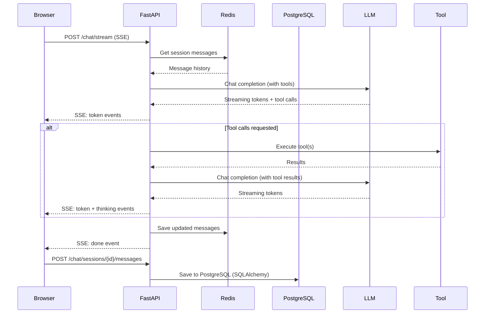
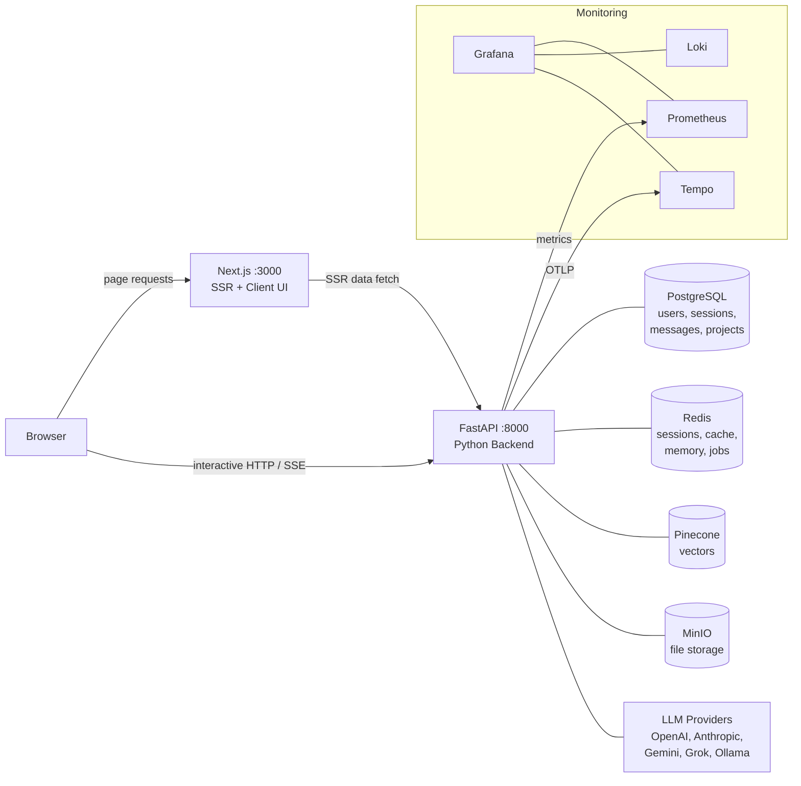

Most "talk to your PDF" demos solve the easy half of the problem: embed a few
chunks, paste the top match into a prompt, ship. The hard half — knowing
*when* to retrieve, when to call the web, when to query a real database, when
to walk a page in a headless browser, and when to just answer — almost never
shows up in the demo.

RunaxAI is built around that hard half. Documents are still the anchor, but
they sit alongside a tool planner, a router, four specialised agents, and an
adaptive retrieval pipeline that changes shape depending on how much you've
uploaded.

This post is a tour of what's actually in the box.

## Two chat modes, deliberately

There are two front doors into RunaxAI and they behave differently on purpose.

**General chat** is the orchestrator with full tool access. You can ask it to
search the web, run SQL against a live PostgreSQL database, browse a page in
a real browser, search a local knowledge base, or look something up in your
portfolio. The loop in `api/chat.py` keeps cycling — call the model, plan
tools, execute, append results, call the model again — until the model
returns text or hits a budget.

**Project chat** is RAG against a project you uploaded. It routes the user's
message to one of four specialised agents, retrieves relevant chunks from the
project's Pinecone namespace, injects them as ephemeral context, and
generates an answer with citations back to the source files. Each agent has
its own system prompt and can override retrieval parameters.

You can think of them as *exploration mode* and *grounded mode*. The same UI,
the same streaming protocol, but very different control loops underneath.

## The tool planner is the interesting part

Anyone can wire a function-calling loop. The reason most of them feel
unreliable is that LLMs love to call the same tool twice, kick off three
sequential calls in parallel, and burn their budget on redundant work.

The planner sits between the LLM's requested tool calls and the actual
executors, and it makes three decisions:

1. **Fingerprint and deduplicate.** Each tool call is hashed by name plus its
   key arguments. If the same fingerprint already ran in this turn and no new
   evidence has come in since, the call is dropped before it executes.
2. **Parallel vs sequential.** Tools marked `parallel_safe` with
   `requires_fresh_input=False` can fan out concurrently. Anything that
   depends on the result of a previous call is serialised.
3. **Budgets.** The orchestrator caps reasoning steps, total tool calls, and
   parallel calls per step. When a budget trips, the planner forces a final
   answer rather than letting the model spin.

The budgets are real and they're tight: three reasoning steps, six total
tool calls, three parallel calls per step in general chat; even tighter
limits in project chat. If you exhaust them, `_force_final_answer()` strips
the tool definitions, injects a "stop calling tools, answer with what you
have" system message, and re-prompts. A second forced pass is harsher still.
A third is a graceful fallback.

That tight ceiling is intentional. It's the difference between an agent that
explores and one that wanders.

## What's in the toolbox

Six tools are wired in today:

- `search` — web search through Brave with an LLM-side summarisation pass so
  you don't get back a page of raw snippets.
- `query_db` — natural language to SQL, executed against a Postgres
  database with a read-only role. Used for the demo dataset (Customers,
  Orders, Products, Reviews) but the schema is swappable.
- `browser_task` — a real headless browser for pages that need interaction
  or that block static scrapers.
- `crawl_website` — multi-page crawl when you need the contents of a site,
  not a single URL.
- `query_local_kb` — a FAISS-backed local knowledge base, separate from the
  per-project Pinecone indexes.
- `portfolio` — portfolio-shaped queries against curated data.

Each tool is a Python module that exports a `SCHEMA` (OpenAI function-calling
format) and a function with a matching name. There's no central registry to
edit; `functions/__init__.py` discovers them on import. Opting into the
result cache is a single `CACHEABLE = True` line. Marking a tool
`parallel_safe` is one entry in a `POLICY` dict.

The economy of adding a tool — schema, function, optional cache and policy,
no registration boilerplate — is the same shape as adding an agent.

## Four agents, picked by intent

Project chat doesn't use the same orchestrator as general chat. Instead, the
router classifies the user's message and picks an agent. The agent's system
prompt replaces the default and the retrieval call is parameterised by the
agent's overrides.

- **Reasoning** — deep analysis, comparison, multi-step Q&A. The default
  pick when nothing else applies.
- **Summary** — overviews, key takeaways, "what is this document about."
- **Quiz** — structured JSON quizzes. Renders as an interactive widget on
  the client, with answers and explanations persisted into message metadata
  so the state survives reloads.
- **Visualisation** — structured JSON for mermaid diagrams, line charts,
  radar charts, comparison tables. Rendered by dedicated components.

The router uses two modes. **Explicit** when the frontend passes an
`agent_name`. **Auto-classify** when it sees `"auto"`: the recent
conversation is sent to a fast model with `max_completion_tokens=10` and
`temperature=0`, the model responds with a single word, and that's the
agent. The classifier sees enough conversation history to handle "one more"
and "again" — useful when a user wants another quiz on the same material.

Adding a new agent is a single file: a `name`, a `description`, a
`system_prompt`, optional retrieval overrides, optional structured-output
hints, optional scoped tool access. Drop the file into `agents/`, restart,
and the registry picks it up. If it needs a new renderer on the frontend,
add a parser and a component to match.

## Retrieval adapts to your corpus

The point of "adaptive retrieval" is that the right pipeline for a 50-page
corpus is not the right pipeline for a 50,000-chunk corpus.

| Range            | Strategy           | Alpha | Top K    | Rerank |
|------------------|--------------------|-------|----------|--------|
| &lt; 500 chunks  | Dense only         | 1.0   | 5        | No     |
| 500 – 10K        | Hybrid             | 0.7   | 10       | Yes    |
| &gt; 10K         | Hybrid + rerank    | 0.5   | 20 → 10  | Yes    |

A small project doesn't benefit from sparse vectors — semantic search alone
finds the right chunk. A medium project starts missing exact keyword matches
and benefits from a BM25-style sparse signal. A large project widens the
candidate pool and then narrows it with a reranker (`bge-reranker-v2-m3`).

Dense embeddings are `text-embedding-3-large` at 3072 dimensions. Sparse
vectors come from `pinecone-sparse-english-v0`. Both are batched at 96 per
API call and stored in the same Pinecone index for hybrid search.

Agents can override the defaults. The quiz agent can pull more chunks for
breadth. A future legal-review agent could push alpha toward sparse for
exact terminology matching. The mechanism is one field on the agent
definition.

A semantic retrieval cache sits in front of Pinecone — queries are embedded
and compared against a Redis vector index for the project, so semantically
similar follow-ups can reuse results without paying for retrieval twice.

## Chunking is opinionated

Chunkers are usually an afterthought. The one in `pipeline/chunker.py` picks
a strategy based on what the document actually looks like:

- **Recursive** is the default — hierarchical separators from triple
  newlines down to characters, trying the coarsest split first.
- **Semantic** kicks in when a document has three or more markdown headers
  and is long enough to matter. It splits on header boundaries so sections
  stay together. Oversized sections fall back to recursive.
- **Row-based** is used for CSVs — the extractor already emits row groups,
  the chunker uses them directly with the column headers attached.

Before any of that, the text is cleaned: collapsed whitespace, stripped
trailing/leading runs of newlines, page-number artefacts removed, repeated
headers and footers detected and stripped. Overlap between chunks is
sentence-boundary-aware: the overlap window scans backward for sentence
endings followed by a capital letter rather than slicing mid-sentence.

These are unglamorous decisions that show up in the answer quality more than
any reranker tweak.

## Streaming and structured content

The transport between backend and frontend is Server-Sent Events. Both chat
modes emit the same vocabulary:

- `token` — a text chunk.
- `thinking` — high-level status (routing, retrieval counts, planning).
- `tool` / `tool_result` — a tool call starting and finishing.
- `agent` — which agent was picked (project chat).
- `retrieval` — passages found, with metadata.
- `error` — something went wrong.
- `done` — final event with tools used, prompt tokens, agent name.

The frontend translates that event stream into discriminated `MessagePart`
shapes (`text`, `reasoning`, `tool-call`, `source`, `data`) used by an
`@assistant-ui/react` runtime. Tool calls render as inline chips you can
expand. Sources render as citations with a hover preview.

When the model emits structured JSON — quizzes, visualisations — the
message bubble runs a three-stage parser: try the raw string as JSON, try a
code-fenced block, try brace-matched trailing JSON. Whichever wins, the
matching renderer takes over. Mermaid diagrams in particular get a singleton
init plus a serial render queue, because parallel renders crash the
library; pan and zoom come from `react-zoom-pan-pinch` with auto-fit.

## Memory has two timescales

Two kinds of memory matter and they live in different stores.

**Session state** is the conversation you're having right now. It lives in
Redis with a 24-hour TTL, keyed by a 12-character hex session ID, owned by a
user via an ownership key. When you send a new message, it goes in there.
When the orchestrator calls a tool, the result goes in there. When you
revisit a session, it gets rehydrated from Postgres into Redis with a fresh
system prompt.

**User memory** is what we want the assistant to remember about *you* across
sessions. After each turn, an ARQ background task extracts memorable facts
from the conversation, dedupes them against existing facts using embedding
similarity, and writes them as `UserMemoryFact` rows. Old facts that get
contradicted are marked `superseded_at` rather than deleted. A rolling
summary task keeps a per-user prose summary up to date so the model can be
primed without dumping every fact into the prompt.

Both passes run off-path — the user sees their answer first; memory is
written after the stream completes. The fact embeddings live in pgvector
alongside the row, so semantic lookup at prompt-build time is a single
indexed query.

## What's underneath

The architecture itself is small enough to fit in one paragraph:

A Next.js 16 frontend talks **directly** to a FastAPI backend — there's no
...
A Next.js 16 frontend talks **directly** to a FastAPI backend — there's no
FastAPI handles auth via `fastapi-users` with cookies, persists everything
to a single Postgres with pgvector, uses Redis for sessions and the ARQ job
queue, talks to Pinecone for document vectors, and stores files in MinIO.
An ARQ worker process handles ingestion and memory writes off the request
path. Observability is the Prometheus / Loki / Tempo / Grafana stack with
custom spans for every LLM call, every retrieval, every tool execution.

The LLM layer is provider-agnostic. OpenAI, Anthropic, Gemini, Grok, and
Ollama all go through the same `LLMClient` facade with the same
instrumentation. Switching the default chat model is a config change, not a
refactor. Different operations can pick different providers — a fast cheap
model for the agent classifier, a stronger one for reasoning, a local
Ollama model for sensitive content.

## What's coming

The roadmap from here is less about new tools and more about making the
existing ones cheaper, faster, and more trustworthy:

- **More visibility into retrieval.** Show what was retrieved, what was
  reranked away, and why each cited passage made the cut.
- **Better cost transparency.** Per-message token and dollar attribution
  surfaced in the UI, not just in Grafana.
- **Richer agent surfaces.** More structured renderers — timelines,
  citations panels, side-by-side document comparison — so the model can
  produce answers in the shape the question actually wants.
- **Sharper memory.** Tighter dedup, better contradiction handling, an
  in-product view of what the system remembers about you, with explicit
  edit and forget controls.

If you're curious about the internals, the `docs/` directory is the long
form — architecture, agents, the RAG pipeline, the tool planner, the LLM
layer, memory, observability. This blog will be where the design notes and
the rationale live as the system keeps evolving.
