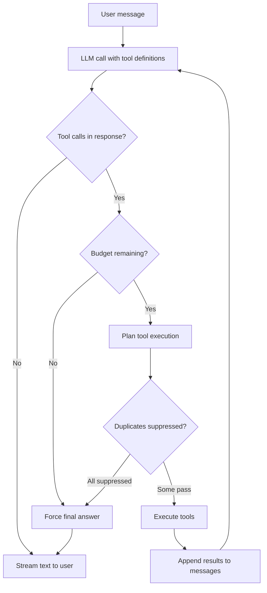

Giving an LLM access to external tools is easy. Making sure it doesn't bankrupt you in an infinite loop of redundant web searches is hard.

In RunaxAI, the `orchestrator` acts as the primary driver for General Chat. It operates on a recursive reasoning loop: the LLM observes the conversation, proposes tool calls, the system executes them, appends the results, and the LLM observes the new state. 

To make this production-ready, we built a strict **Tool Planner** (`utils/tool_planner.py`) and implemented rigorous budget constraints. Here is how we tame the loop.

## 1. Budget Constraints

An unchecked agent will confidently search Google for "current weather" ten times in a row if it fails to read the JSON response correctly. We enforce strict budgets:

- **Max Reasoning Steps:** 3
- **Max Total Tool Calls:** 6
- **Max Parallel Calls per Step:** 3

If the agent exhausts its budget, the orchestrator physically intercepts the loop and injects a firm system prompt:
> *"You have reached the maximum number of tool calls. Do NOT attempt any more tool calls. Respond with the best answer you can based on the information you have gathered so far."*

If the model *still* attempts to output a tool call, we forcefully disable tools in the API payload for a final generation pass.

## 2. The Tool Planner & Duplicate Suppression

When the LLM requests a batch of tool calls, the Tool Planner intercepts them before execution to enforce policies:

- **Parallel vs. Sequential Execution:** Tools registered as `parallel_safe=False` or `requires_fresh_input=True` are executed sequentially. If the LLM requests three such tools at once, the planner executes one, returns the result to the LLM, and defers the others, forcing the LLM to reassess if it still needs them.
- **Fingerprinting & Duplicate Suppression:** The planner generates a SHA-256 fingerprint for every requested tool call (based on its name and arguments). It tracks these against a `tool_evidence_version`. If the LLM requests the *exact same* tool call twice, and no new evidence has been introduced to the context window in between, the planner **suppresses** the call entirely. The LLM is informed that the call was redundant, forcing it to try a different approach or finalize its answer.

## 3. Dynamic Summarization

Context windows are large nowadays, but filling a 128k context window with dense web-crawl JSON is both expensive and degrades model reasoning (the "lost in the middle" phenomenon).

When a session exceeds `40,000` prompt tokens (or `60,000` in RAG/Project mode), the orchestrator triggers dynamic summarization (`utils/summarizer.py`). 

1. It identifies a safe split point, ensuring it doesn't sever a tool call from its corresponding result.
2. It leaves the 4 most recent messages untouched.
3. It passes the older messages to a cost-efficient LLM to generate a rolling summary.
4. It replaces the old message history with a single `[Previous conversation summary]` block.

Crucially, this system preserves file attachment references so the LLM doesn't lose access to uploaded document metadata. It also invalidates the Redis `memory-last-extracted` cursor so the background memory extraction worker knows how to re-sync with the newly compressed history.

## 4. Multi-Provider Provider Registry

Underneath the orchestration loop, the system executes against an `LLMProviderRegistry` (`llm/factory.py`). This allows us to abstract away the specific vendor (OpenAI, Anthropic, Gemini, Grok, Ollama). 

Every single call passes through an instrumentation wrapper that tracks:
- **Time-To-First-Token (TTFT)**
- **Tokens/Second throughput**
- **Cost Estimation** (usd/token)

Because of this abstraction, the orchestrator can confidently route a complex reasoning task to a high-capability model like `claude-3-5-sonnet`, pass the background memory extraction to the project default `gpt-5.4-mini`, and generate embeddings with `text-embedding-3-small`—all while maintaining perfectly unified tracing and telemetry.