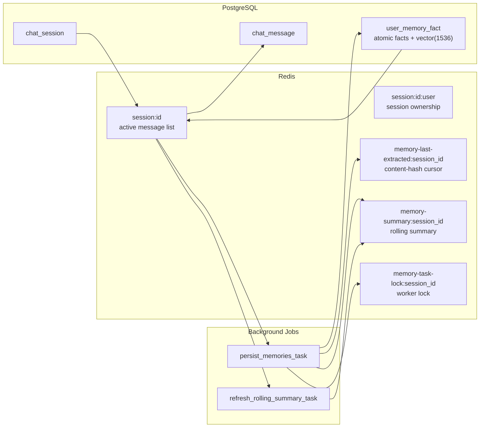
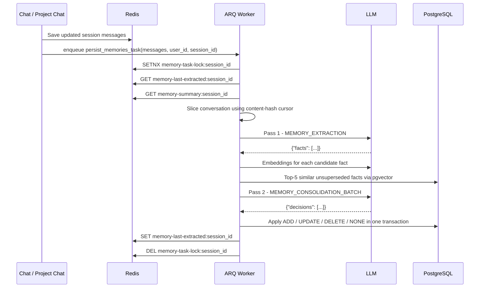

The first version of memory in RunaxAI was four text blobs per user — a
"preferences" string, a "context" string, a "background" string, a "goals"
string. The model would write back updated blobs at the end of a session.
This is the design most chat apps ship with. It is also the design that
quietly degrades.

Blobs forget where a fact came from. They forget *when* it was true. They
get rewritten wholesale on every update, which means the model is
re-derivation-cost-per-turn. And they merge contradictions silently — if
you told the assistant on Monday you were using Postgres and on Friday
you'd switched to SQLite, the next blob rewrite picks one and pretends the
other never happened.

We rebuilt it. Memory is now a set of **atomic facts** with audit-friendly
supersession, embedded into pgvector, written by an off-path worker. This
post is the design tour.

## Three stores, three jobs

Memory in RunaxAI lives in three places because three different jobs need
three different storage shapes.



**Working state** lives in Redis. The current message list for an active
session, the ownership binding (who started this session), the agent the
project chat router last picked, and — added for the new pipeline — a
content-hash cursor that tracks how far the extractor has progressed and a
rolling summary used as disambiguation context.

**Durable history** lives in Postgres. Every saved `chat_session` and
`chat_message` row, with the message metadata column carrying client-side
state like quiz answers or visualization variant. This is the restore
source if Redis evicts the live session.

**Long-term user memory** lives in `user_memory_fact`, one Postgres table
with a `vector(1536)` column. Each row is one atomic fact, with
`observed_at`, `superseded_at`, `superseded_by`, and `source_session_id`.
Facts are never overwritten in place. When one changes, the old row gets
`superseded_at = now()` and a new row is inserted. The history is the
data; nothing is destructive.

The old four-blob design still exists as a backfill source. That's it.

## A fact, not a paragraph

A "fact" in this system is one short sentence:

- `Builds RunaxAI with FastAPI`
- `Prefers concise explanations`
- `Lives in Bengaluru`
- `Uses uv for Python package management`

Atomic facts are easier on every downstream consumer:

- **Extraction** is cheaper because the LLM has a tighter shape to fill —
  it produces a JSON array of strings instead of negotiating updates to a
  free-form paragraph.
- **Embedding** is meaningful because each row is one concept, not a
  paragraph mixing five concepts at one embedding point.
- **Supersession** is exact. "User switched from Postgres to SQLite"
  becomes one fact superseding another, with `superseded_by` pointing at
  the new row.
- **The UI** can render facts as a list with edit and delete affordances
  the user understands.

The schema reflects this:

```text
user_memory_fact(
  id,
  user_id,
  text,
  embedding vector(1536),
  observed_at,
  superseded_at,
  superseded_by,
  source_session_id
)
```

`source_session_id = "manual-memory"` for facts the user added through the
UI, `"backfill-from-redis"` for the one-time backfill, and the real session
id for facts extracted by the worker.

## Writing memory is off-path

Memory writes do not block the chat turn. The user gets their answer
first; extraction happens after.

The end of a chat turn looks like this:

1. The assistant response is appended to the Redis session.
2. The updated message list is persisted to Postgres.
3. `schedule_memory_persistence(session_id, user_id, messages)` enqueues an
   ARQ job and returns immediately.



The user sees `done`. They start typing the next message. Meanwhile, in a
worker process, `persist_memories_task` runs.

## The content-hash cursor

The first thing the worker has to figure out is: *what's new since the last
time I ran?*

The naive way is "remember the index of the last processed message and
slice from there." The naive way breaks the first time the conversation
gets summarized. After a summarization pass, messages 1–20 collapse into
"[Previous conversation summary]" plus a few recent turns. The old index
points into the void.

We use a content-hash cursor instead:

- `sha256(f"{role}:{content}")` of the last processed message
- stored at `memory-last-extracted:<session_id>`

The worker logic:

1. Acquire `memory-task-lock:<session_id>` with a 5-minute TTL (single
   writer per session).
2. Load the cursor.
3. **No cursor** — first run, process the entire conversation.
4. **Cursor found in the current messages** — process only what comes
   after.
5. **Cursor found nowhere** — the conversation was summarized, the cursor
   message is gone. Treat the whole current conversation as new and
   process it from the top of the summary onward.
6. Load `memory-summary:<session_id>` if present (the rolling summary,
   covered below).
7. Run extraction + consolidation.
8. Advance the cursor to the hash of the last processed message.

This means a session that goes through summarization doesn't silently
skip an entire pre-summary block of conversation. It also means we don't
re-extract from the beginning every turn — only from where we left off.

## Two LLM passes, not one

A single extraction pass would write down duplicates and contradictions
without noticing. So we run two.

**Pass 1: extraction** sees the conversation slice plus the optional
rolling summary plus the observation date. Its job is to return a JSON
list of atomic facts. The extractor sees assistant turns too — that's
necessary for disambiguation — but it's instructed to extract only facts
the user explicitly stated or confirmed. The prompt biases toward durable
categories: identity, location, occupation, tech stack, hardware,
long-running projects, learning goals, communication preferences,
education, languages. Things that will still be true next week, not things
that change message-to-message.

Output looks like:

```json
{"facts": ["Builds RunaxAI with FastAPI", "Prefers concise explanations"]}
```

**Pass 2: consolidation.** Each candidate fact gets embedded with
`text-embedding-3-small`. For each candidate, the worker queries Postgres
for the top-5 most similar **active** facts (`superseded_at IS NULL`)
using pgvector cosine distance. The candidate batch plus its similar-fact
neighborhoods goes to a second prompt that returns one decision per
candidate:

| Decision | Effect                                                              |
|----------|---------------------------------------------------------------------|
| `ADD`    | Genuinely new — insert a new row.                                   |
| `UPDATE` | Replaces an existing fact — insert the new row, mark the old `superseded_at`, set `superseded_by` to the new row's id. |
| `DELETE` | Old fact is no longer true and there's no replacement — mark `superseded_at`, no new row. |
| `NONE`   | Already covered — do nothing.                                       |

All writes for a single batch happen in one transaction.

`UPDATE` is the interesting one. When the user changes their mind about
their stack, we don't erase the history; we record the transition. A
year-old fact tagged `Uses Postgres` ends up superseded by a newer
`Uses SQLite`, and the link between them survives in `superseded_by`. The
read path only sees the new fact, but the audit trail lives forever.

## The rolling summary isn't memory

There's a Redis key called `memory-summary:<session_id>`. It's not where
memories live. It exists for one purpose: to help the extractor
disambiguate short replies.

Imagine the conversation ends with:

> "Yes, that one. Use the earlier option."

The extractor needs to know what "that one" and "the earlier option" mean.
The rolling summary, refreshed every 10 user turns and after summarization
and at session end, is a brief prose narrative of what's been discussed.
It's prepended to the extractor's input so it can reach back through
references the literal slice doesn't cover.

The rolling summary is regenerated, not appended to. It can be stale by a
few turns; that's fine — extraction runs frequently enough that staleness
is bounded.

## Reading memory: how it reaches the model

When a new session is created or restored:

1. `get_user_memory(user_id)` selects every active fact (`superseded_at IS NULL`).
2. Facts are ordered by `observed_at ASC`.
3. They're formatted as a bullet list.
4. The list is appended to the session's system prompt under
   `Known facts about the user:`.

That's it. There's no mid-turn hot reload — facts learned during a session
aren't picked up by that same session, they apply to the *next* session
the user starts. The simplification is intentional: it makes the system
prompt deterministic for the lifetime of a session, which keeps caching
and tracing sane.

Today we inject *all* active facts. That's a known limitation — at a few
hundred facts per user it's fine; past that we'll need top-k retrieval at
prompt-build time, using the same pgvector index that consolidation
already queries. The mechanism is already there; we just haven't flipped
it on.

## Observability

Memory extraction is the kind of background process that gets ignored
until it silently breaks. We instrument every phase with its own span:

- `extract` — pass 1
- `embed` — candidate embeddings
- `consolidate` — pass 2
- `persist` — DB writes
- `summary` — rolling summary refresh

So when memory writes get slow, the trace tells us whether it's the LLM,
pgvector, or the transaction. Memory isn't a black box; it's a pipeline
with five named stages, each one attributable in Grafana.

## What we got out of it

The atomic-fact design isn't just cleaner data. It gives us:

- **Audit trail.** Every change to a fact leaves a row behind. If memory
  ever starts hallucinating things the user didn't say, we can read
  exactly which session inserted that row, and on what conversation
  slice.
- **Cheap mid-session restart.** The content-hash cursor means a worker
  crash or a deploy doesn't lose track of what's been extracted.
- **Honest contradictions.** Switching tech stack, changing role, moving
  cities — these aren't merge conflicts the model resolves silently.
  They're explicit supersession events.
- **A real UI.** The memory panel shows one list of active facts. Users
  add facts directly with `POST /chat/memory`. They remove facts with
  `DELETE /chat/memory/{fact_id}`, which sets `superseded_at` rather than
  deleting the row. The data shape and the user-facing concept finally
  match.

The bar we want to hit is: a user can look at what the system remembers
about them, edit it, and trust that it accurately reflects what they've
actually said. The atomic-fact design is what makes that possible. The
blob design we shipped first never could have.
