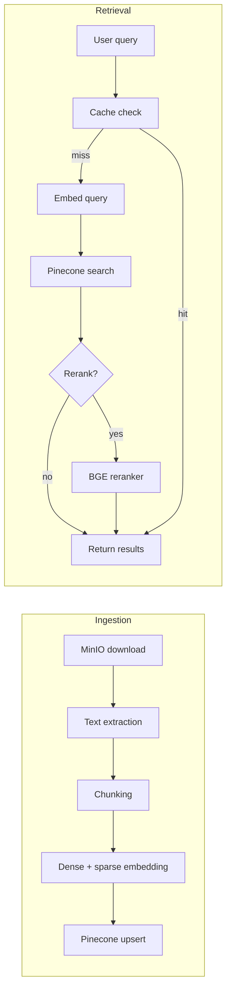

Building a robust Retrieval-Augmented Generation (RAG) system is rarely as simple as throwing chunks into a vector database and running a cosine similarity search. When you transition from a "toy" dataset of a few PDFs to a sprawling project with thousands of diverse documents, a static retrieval strategy breaks down.

In RunaxAI, we built an **Adaptive Retrieval Pipeline** that fundamentally shifts its strategy based on the characteristics and size of the user's corpus. Here is a deep dive into the ingestion and retrieval architecture.



## 1. Intelligent Chunking

Before embedding, documents are downloaded from MinIO, and text is extracted and cleaned to remove artifacts like repeated headers/footers. We don't use a one-size-fits-all chunking method. Instead, `pipeline/chunker.py` auto-selects a strategy:
- **Semantic Chunking:** For markdown-heavy documents with clear section headers, we split by headers to keep contextual sections together.
- **Row-Based Chunking:** For tabular/CSV data, each row group becomes its own chunk.
- **Recursive Splitting:** The default fallback. We recursively split text using progressively finer separators (paragraphs, sentences, words) while applying a 300-character overlap that respects sentence boundaries.

## 2. Dual Embeddings (Dense + Sparse)

A pure dense vector search (like OpenAI's `text-embedding-3-large`) is incredible at capturing semantic meaning, but it often fails at exact keyword matching (e.g., searching for a specific UUID, an obscure acronym, or a specific user's name).

To solve this, we generate **both** dense and sparse embeddings at ingestion time:
- **Dense:** 1536-dimensional vectors via `text-embedding-3-large` to capture meaning.
- **Sparse:** SPLADE-style embeddings via `pinecone-sparse-english-v0` to capture exact keyword importance.

Both vectors are upserted into Pinecone, allowing us to perform Hybrid Search.

## 3. Adaptive Retrieval Configuration

When a query comes in, the pipeline evaluates the size of the project corpus (`chunk_count`) to dynamically adjust the retrieval hyperparameters:

```python
def get_retrieval_config(chunk_count: int) -> dict:
    if chunk_count < 500:
        return {"alpha": 1.0, "top_k": 5, "rerank": True}
    elif chunk_count < 10000:
        return {"alpha": 0.7, "top_k": 10, "rerank": True}
    else:
        return {"alpha": 0.5, "top_k": 20, "rerank": True}
```

- **Small Corpora (&lt;500 chunks):** We rely 100% on dense vectors (`alpha: 1.0`) because the search space is small enough that semantic search easily surfaces the right content.
- **Medium Corpora (&lt;10,000 chunks):** We blend sparse and dense (`alpha: 0.7`), giving a slight edge to semantic meaning while respecting keywords.
- **Large Corpora (&gt;10,000 chunks):** The search space is massive. We rely heavily on sparse matching (`alpha: 0.5`) to act as a strict filter for exact terms before considering semantic similarity.

## 4. HyDE (Hypothetical Document Embeddings)

Short, vague queries (e.g., "how to deploy") often retrieve poorly because the query string looks nothing like the target document conceptually. 

When the agent enables it, we route the user query through a fast LLM pass to generate a **Hypothetical Document**—a synthetic answer to the query. We then embed this *synthetic answer* rather than the short query. Because the synthetic answer conceptually mirrors the target document, dense retrieval accuracy skyrockets. *(Note: We only use the HyDE passage for the dense embedding. Sparse embedding strictly uses the literal user query to preserve exact keyword matching).*

## 5. Cross-Encoder Reranking

Vector search is fast but coarse. It compares queries to documents in isolation. To get the final, highest-quality context, we use a Cross-Encoder Reranker (`bge-reranker-v2-m3`).

The pipeline uses an **oversampling strategy**:
If we need a final `top_k` of 10, we pull the top 40 candidates from Pinecone (`RERANK_OVERSAMPLE = 4`). We then pass the literal user query and these 40 text chunks to the reranker, which scores them by reading the query and the document simultaneously. The top 10 reranked results are then injected into the agent's context window.

This architecture ensures that whether a user is chatting with a 5-page PDF or a 5,000-page corporate wiki, the LLM receives the highest-fidelity evidence possible.